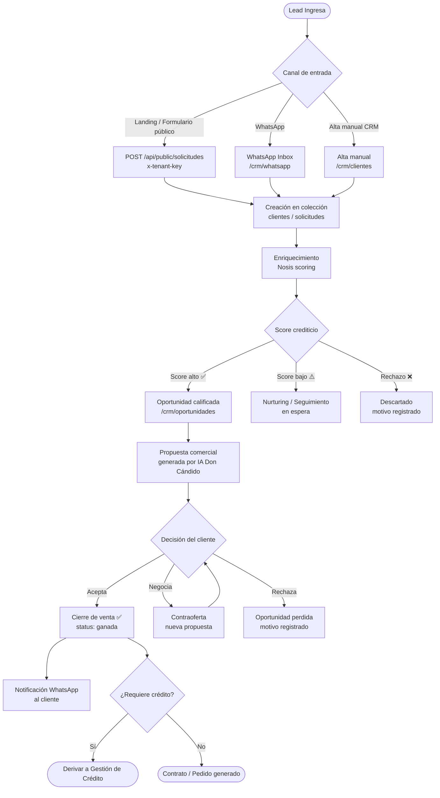
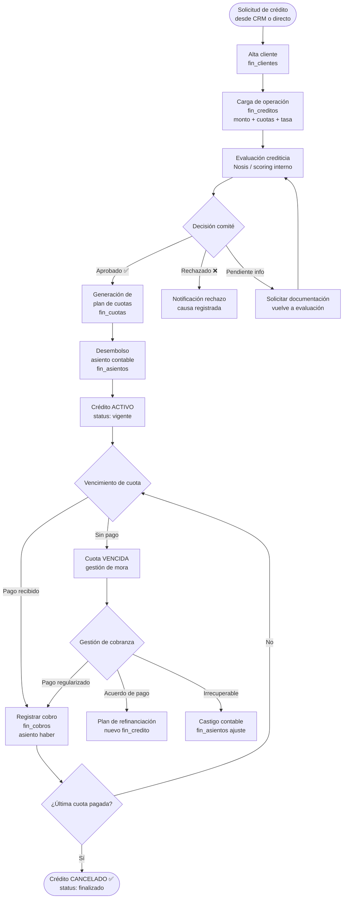
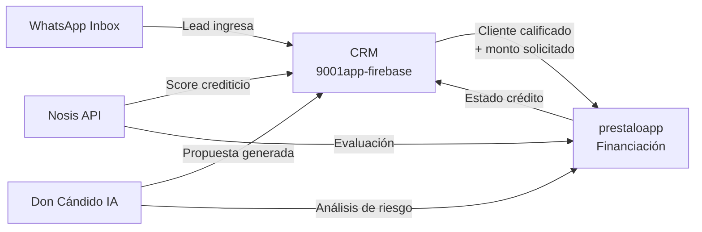

# Flujos: Ventas y Gestión de Crédito

**Proyecto:** Don Cándido / 9001app-firebase + prestaloapp
**Fecha:** 2026-03-24

---

## 1. Proceso de Ventas — CRM

---

## 2. Gestión de Crédito — prestaloapp

---

## 3. Integración entre ambos flujos

