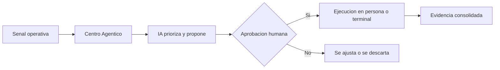

# Centro Agentico - guion de demo comercial

Duracion estimada: 3 a 5 minutos

## Mensaje central

El Centro Agentico muestra una promesa concreta: IA accionable con control humano. La plataforma detecta senales, propone el mejor siguiente paso y deja la aprobacion final en manos del negocio.

## Apertura

1. Abrir la pantalla del Centro Agentico.
2. Presentar la idea en una frase: "Aca no mostramos un chatbot; mostramos decisiones listas para operar, con control y evidencia".
3. Marcar los tres ejes del hero:
   - deteccion
   - orquestacion
   - ejecucion con aprobacion

## Recorrido sugerido

### 1. Capacitacion vencida

Contar:
"El sistema detecta a una persona que quedo fuera de vigencia. La IA no ejecuta sola: propone el turno correcto, estima el impacto y deja la accion preparada para aprobacion."

Mostrar:
- selector de escenario
- evento detectado
- accion propuesta
- persona y terminal impactada

Cierre de la escena:
"La organizacion recupera cumplimiento sin perseguir planillas ni perder trazabilidad."

### 2. Hallazgo sin responsable

Contar:
"Aca la IA no inventa una solucion: resuelve un vacio operativo. Detecta un hallazgo sin duenio, cruza contexto y sugiere a quien asignarlo."

Mostrar:
- prioridad del evento
- workflow del caso
- fundamento de la asignacion

Cierre de la escena:
"En vez de tener hallazgos huerfanos, el equipo decide sobre una recomendacion ya preparada."

### 3. No conformidad detectada

Contar:
"Cuando aparece una desviacion relevante, la IA acelera el pasaje desde auditoria hasta una accion formal. El borrador llega armado y calidad conserva el control."

Mostrar:
- narrativa del caso
- accion propuesta para crear la no conformidad
- evidencia final esperada

Cierre de la escena:
"La plataforma reduce tiempo administrativo y mejora consistencia documental."

### 4. Terminal o persona con aprobacion pendiente

Contar:
"Esta es la ultima milla. La accion ya esta lista para ejecutarse sobre una terminal o una persona, pero el sistema frena y espera la conformidad humana."

Mostrar:
- canal y terminal
- politica aplicada
- estado de aprobacion

Cierre de la escena:
"La IA acelera, pero no salta gobernanza."

## Remate comercial

Cerrar con esta idea:
"El valor no es solo detectar problemas. El valor es llegar a la accion correcta, en la persona correcta, con evidencia y control humano en cada paso."

## Diagrama Mermaid

## Uso en Whimsical

1. Copiar el bloque Mermaid.
2. Abrir un board en Whimsical.
3. Pegar el codigo para convertirlo en diagrama editable.
