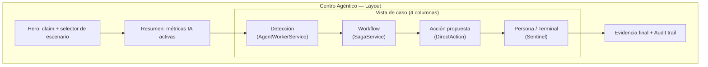
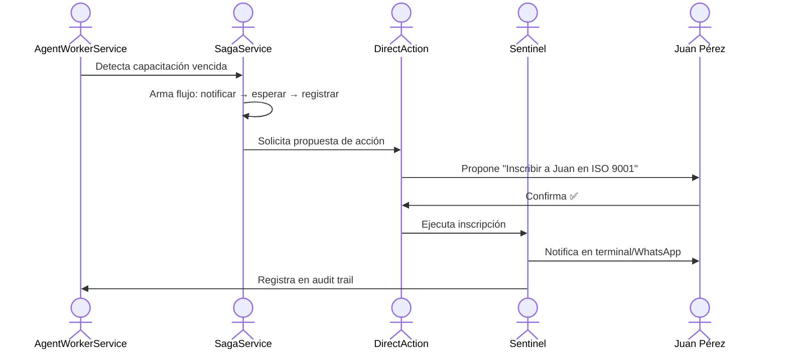
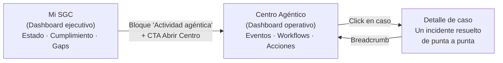

# Centro Agéntico — Diagramas Mermaid semilla

Tres diagramas listos para usar: como punto de partida en documentación técnica, embebidos en el chat de Don Cándido, o importados a Whimsical como base de wireframe.

---

## Diagrama 1 — Arquitectura de la pantalla Centro Agéntico

**Para qué sirve:** muestra la estructura de bloques de la pantalla Centro Agéntico de izquierda a derecha / arriba a abajo. Útil para alinear con producto sobre qué secciones existen, en qué orden aparecen y qué sistema IA alimenta cada columna. Base para el wireframe de layout.

**Para importar a Whimsical:** copiar el bloque entre las marcas ` ```mermaid ` y ` ``` `, abrir un board en Whimsical, ir a Insert → Mermaid y pegar el código.



---

## Diagrama 2 — Flujo de caso demo "Capacitación vencida"

**Para qué sirve:** muestra el flujo de punta a punta de un caso demo concreto — cómo el sistema detecta una capacitación vencida, arma el workflow, propone una acción, la ejecuta con confirmación humana y registra el resultado. Ideal para demos de inversor y para documentar el happy path del caso más representativo del Centro Agéntico.

**Para importar a Whimsical:** copiar el bloque entre las marcas ` ```mermaid ` y ` ``` `, abrir un board en Whimsical, ir a Insert → Mermaid y pegar el código.



---

## Diagrama 3 — Relación Mi SGC → Centro Agéntico → Detalle de caso

**Para qué sirve:** muestra la navegación entre las tres capas del dashboard — Mi SGC como vista ejecutiva de estado, Centro Agéntico como vista operativa de eventos y workflows, y el Detalle de caso como vista de un incidente resuelto de punta a punta. Aclara cómo se conectan las pantallas y dónde vive cada nivel de información.

**Para importar a Whimsical:** copiar el bloque entre las marcas ` ```mermaid ` y ` ``` `, abrir un board en Whimsical, ir a Insert → Mermaid y pegar el código.


